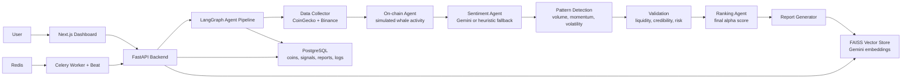

# Autonomous Crypto Research & Alpha Discovery Agent

Production-quality full-stack system that continuously scans crypto markets and produces **explainable, structured “alpha” opportunities** via a **LangGraph multi-agent pipeline**.

## Stack

- **Frontend**: Next.js (App Router) + TypeScript + Tailwind + shadcn-style UI + Framer Motion + Recharts + Zustand
- **Backend**: FastAPI + LangGraph + PostgreSQL + Redis + Celery workers
- **AI**: Gemini Developer API for sentiment + embeddings, with heuristic fallbacks when quotas are unavailable
- **Vector search**: FAISS semantic search over generated opportunities

## Architecture



## Quick start (Docker)

1. Copy env:

```bash
cp .env.example .env
```

2. (Optional) set `GEMINI_API_KEY` in `.env` to enable:
   - Gemini sentiment analysis (instead of heuristic)
   - Gemini embeddings + FAISS semantic search (`/api/search`)

3. Start:

```bash
docker compose up -d --build
```

4. Open:
   - **Dashboard**: `http://localhost:3000`
   - **Backend**: `http://localhost:8000/healthz`

### Ports

- **Postgres**: host `5433` → container `5432`
- **Redis**: host `6380` → container `6379`
- **Backend**: `8000`
- **Frontend**: `3000`

## Multi-agent pipeline (LangGraph)

Order:

Fetch Data → On-chain Signals → Sentiment → Pattern Detection → Validation → Ranking → Report

Every step writes an explainability record to `agent_logs`:
- structured **input/output**
- timestamps
- step durations

## Backend API

All routes are under `/api`.

- `POST /api/fetch-data`
- `POST /api/run-agents`
- `GET /api/opportunities`
- `GET /api/reports`
- `GET /api/reports/{id}`
- `GET /api/signals`
- `GET /api/logs`
- `GET /api/search?q=...&k=...` (requires `GEMINI_API_KEY`)

## Database schema

Primary tables:
- `coins`
- `market_data`
- `signals`
- `opportunities`
- `reports`
- `agent_logs`

Optional future-proofing:
- `news_items`

## Development notes

- Celery Beat triggers `run_alpha_pipeline` every **15 minutes** by default.
- CoinGecko is used for “trending” + market snapshots; Binance enrichment is best-effort (symbol availability differs).
- On-chain agent is **simulated but deterministic** (seeded per symbol) so outputs are stable.
